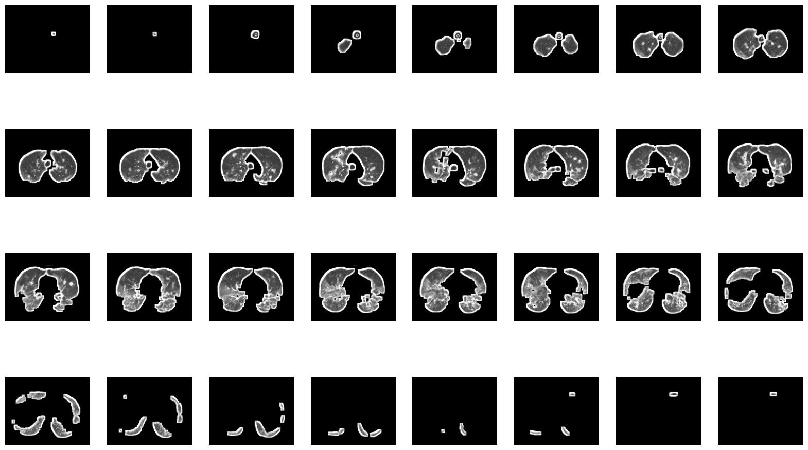
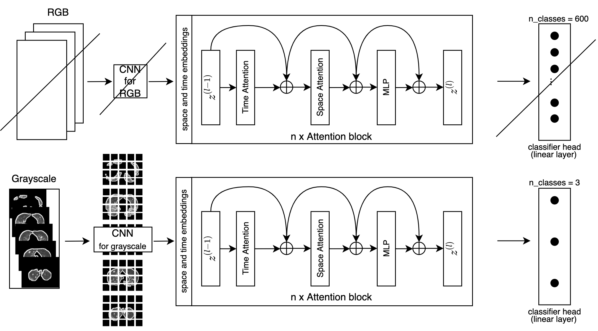
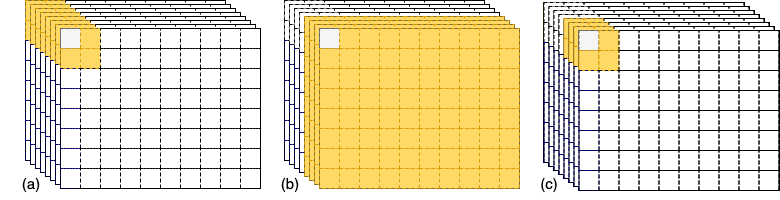

# 3d-transformer-med-classification

This repository contains implementations for the thesis "Covid-19 Diagnosis In 3D Chest CT
Scans With Attention-Based Models". The goal of this thesis is to investigate 3D image classification
in the medical context with attention based models, specifically, Covid-19 classification on 3D lung CT scans.
The models DenseNet121 and TimeSformer are used. Within this research, new attention schemes for TimeSformer are proposed.

## Table of Contents
* [Information about the project](#general-information)
* [Setup](#setup)
* [Models](#models)
* [Acknowledgements](#acknowledgements)

## Information about the project
The three dimensional information in CT scans reveals a lot of findings in the medical context, also for detecting symptoms 
of COVID-19 in chest CT scans (Shamshad et al. [2022](https://arxiv.org/pdf/2201.09873.pdf)). However, due to the lack of availability of 
large scale datasets in 3D, 
the use of attention-based model in this field is proven to be difficult.
With transfer learning and domain adaptions, this thesis wants to tackle this problem and investigates the performance of 
attention-based models on COVID-19 two-class and multi-class classification in 3D chest CT scans and compares these results 
to the performance of classical Convolutional Neural Networks.
The CC-CCII dataset (Zhang et al., [2020](https://www.cell.com/cell/pdf/S0092-8674(20)30551-1.pdf)) is a publicly available 3D chest CT scan dataset 
that we modify for our research purpose.
We propose the first application of a pure vision transformer-based model for COVID-19 CT scan classification that is using 
the 3D information in the CT scans. This is done by applying a pre-trained TimeSformer model (Bertasius et al., [2021](https://arxiv.org/pdf/2102.05095.pdf)) on the 
modified dataset. The attention-based model is outperforming our DenseNet121 (Huang et al., [2018](https://arxiv.org/pdf/1608.06993.pdf)) baseline model in accuracy 
by up to 4% and 7% for two and three classes, respectively.
We also propose three newly developed attention schemes in addition to the attention schemes developed for TimeSformer. 
One of them, the "space-limited" attention scheme, is able to outperform other attention schemes by around 2% in accuracy 
and reduces runtime by almost one third compared to the original attention scheme.

## Setup
For the setup of environments, follow the installation instructions for packages in `readme.txt`.
Once the environment for the desired model is set up, DenseNet121 can be trained and evaluated by running `dense_net_call.py`
and the same for TimeSformer by running `timesformer_call.py`. These two files also contain the parameter setup for the models.
If a different configuration for the new attention schemes is needed, this can be adjusted directly in `vit.py`. `

## Models and Data
For our experiments we use the [CC-CCII dataset](https://github.com/wang-shihao/HKBU_HPML_COVID-19). We
resize and cut the 3D CT scans to a size of 160x128 (width x height) by using bounding boxes to cut off as less lung parts as possible. We sample
the slices in the scan with a symmetrical downsampling strategy to 32 slices. The code for pre-processing is available in the 
folder `preprocess`.  The file `data_set_creation.py` starts the pre-processing pipeline.  

This is an example of one pre-processed scan of our dataset:

For other comparisons, we created two more datasets that are half the size, so 80x64x16 (width x height x depth).
One dataset takes the middle 16 slices of the scan (called `mid`) and the other dataset takes every second slice (called `2nd`).

The datasets are available here:  
https://drive.google.com/drive/folders/1xHaQyZCGjSYgd11fktD22Ue2WhFPPvwd?usp=sharing  
The names of the datasets are structured as follows:
`dataset_<class>_<train/valid/test>_<image_slice_size>.npz`

We fine-tune a pre-trained TimeSformer model on our datasets. For this, we modify the TimeSformer architecture such that it
fits for grayscale 3D images:

In the thesis, we propose three new attention schemes for TimeSformer:
space-limited attention `sl` (a), time-limited attention `tl` (b) and space-and-time-limited attention `stl` (c).

Fine-tuned models can be found here:  
https://drive.google.com/drive/folders/1Wf8sRcY-h5JbQsLkou1s--QE-uAMSr-g?usp=sharing  
The names of the models are structured as follows:  
`<model>_<attention_scheme><attention_scheme_param>_<n_classes>_<dataset_size>.py`

<!-- more explanation -->
<!--  -->

## Acknowledgements
- Dataset: https://github.com/wang-shihao/HKBU_HPML_COVID-19
- TimeSformer: https://github.com/facebookresearch/TimeSformer/blob/main/timesformer/models/vit.py
- DenseNet: https://towardsdatascience.com/creating-densenet-121-with-tensorflow-edbc08a956d8
- Attention Visualization: https://github.com/yiyixuxu/TimeSformer-rolled-attention